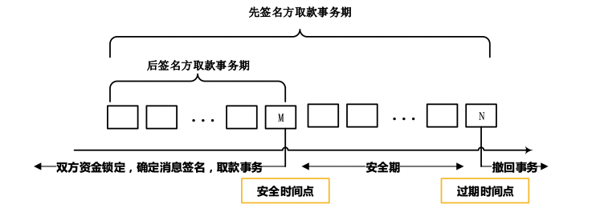

# fisco
 HTLC-based cross-chain protocol implemented on fisco-bcos


1. Setup multiple fisco-bcos chains with ./setup/auto.sh

```sh
./auto.sh 127.0.0.1 4
```

2. Create python environment

```sh
conda create --name fisco python=3.7
conda activate fisco
pip install -r ./remote/requirements.txt
pip uninstall -y eth-utils eth-account eth-rlp
```

3. Launch console with ./wallet/src/fisco-client/console.py

```sh
python console.py
```

4. ERC20

```
multi-deploy TokenA

transfer 1 TokenA 0x0000000000000000000000000000000000000000 100

getBalance 1 TokenA

getBalance 1 TokenA 0x0000000000000000000000000000000000000000

multi-deploy testApprove

approve 1 TokenA testApprove 200

allowed 1 TokenA testApprove

depositApprove 1 TokenA 300 // fail: 'status': '0x16'

allowed 1 TokenA testApprove

getBalance 1 TokenA

depositApprove 1 TokenA 100 // success

allowed 1 TokenA testApprove

getBalance 1 TokenA
```

5. OneWayTransfer.sol

Add a second account (0xe2d3cfc6097c3cc6beed6c3ed28799fe58f45ae2)

```
switchAccount

switchAccount 0x5360cf77373e8e2eea6c59e3361948094a7e1c09
```

Continue

```
multi-deploy oneWayTransfer

multi-approve TokenA oneWayTransfer

getBalanceInfo TokenA

createCus 0xe2d3cfc6097c3cc6beed6c3ed28799fe58f45ae2 scrt
```

Edit ~/.fisco-wallet/OneWayTransfer/scrt/cus.yaml

```yaml
secret: scrt
from_addr: '0x5360cf77373e8e2eea6c59e3361948094a7e1c09'
to_addr: '0xe2d3cfc6097c3cc6beed6c3ed28799fe58f45ae2'
token_name: TokenA
value: 200
transactions:
  tx1:
    group_id: 1
    value: 100
  tx2:
    group_id: 2
    value: 100
```

Continue

```
viewTransfer scrt

oneWayTransfer deposit 200 scrt

getBalanceInfo TokenA

txPools oneWayTransfer 0x5360cf77373e8e2eea6c59e3361948094a7e1c09 scrt

switchAccount 0xe2d3cfc6097c3cc6beed6c3ed28799fe58f45ae2

oneWayTransfer withdraw 1 0x5360Cf77373E8e2eEa6c59E3361948094A7e1C09 scrt

oneWayTransfer withdraw 2 0x5360Cf77373E8e2eEa6c59E3361948094A7e1C09 scrt

getBalanceInfo TokenA
```

Use load balancing instead of editing cus.yaml by yourself and refund after expiration

Add a third account (0xa30379d93d4f6a98fbe1a526c090471a7180b955)

```
switchAccount

switchAccount 0x5360cf77373e8e2eea6c59e3361948094a7e1c09

transfer 1 TokenA 0xa30379d93d4f6a98fbe1a526c090471a7180b955 10000
 
transfer 2 TokenA 0xa30379d93d4f6a98fbe1a526c090471a7180b955 10000

switchAccount 0xa30379d93d4f6a98fbe1a526c090471a7180b955

getBalanceInfo TokenA

multi-approve TokenA oneWayTransfer

oneWayTransfer deposit 500 scrt2 TokenA 0x5360cf77373e8e2eea6c59e3361948094a7e1c09

txPools oneWayTransfer 0xa30379d93d4f6a98fbe1a526c090471a7180b955 scrt2

getBalanceInfo TokenA

getBlockNumber 1 // wait for block height beyond expiration

oneWayTransfer refund 1 scrt2

getBalanceInfo TokenA
```

3. TwoWayExchange.sol



```
multi-deploy twoWayExchange
```

Add a fourth account (0x1d8deee6fa2d32d28fe2a5404d1e711c575be9c8)

```
switchAccount

switchAccount 0x5360cf77373e8e2eea6c59e3361948094a7e1c09

multi-approve TokenA twoWayExchange

transfer 1 TokenA 0x1d8deee6fa2d32d28fe2a5404d1e711c575be9c8 10000
 
transfer 2 TokenA 0x1d8deee6fa2d32d28fe2a5404d1e711c575be9c8 10000

switchAccount 0x1d8deee6fa2d32d28fe2a5404d1e711c575be9c8

getBalanceInfo TokenA

multi-approve TokenA twoWayExchange
```

Continue

```
createMsg msg
```

Edit ~/.fisco-wallet/TwoWayExchange/msg/msg.yaml

```yaml
secret: msg
A_addr: '0x5360cf77373e8e2eea6c59e3361948094a7e1c09'
B_addr: '0x1d8deee6fa2d32d28fe2a5404d1e711c575be9c8'
token_name: TokenA
value: 100
A2B_transactions:
  tx1:
    group_id: 1
    value: 1
  tx2:
    group_id: 2
    value: 99
B2A_transactions:
  tx1:
    group_id: 1
    value: 99
  tx2:
    group_id: 2
    value: 1
```

```
viewExchange msg

twoWayExchange deposit msg

switchAccount 0x5360cf77373e8e2eea6c59e3361948094a7e1c09

twoWayExchange deposit msg

txPools twoWayExchange 0x1d8deee6fa2d32d28fe2a5404d1e711c575be9c8 msg

txPools twoWayExchange 0x5360cf77373e8e2eea6c59e3361948094a7e1c09 msg

checkTxs msg 0x1d8deee6fa2d32d28fe2a5404d1e711c575be9c8 0x5360cf77373e8e2eea6c59e3361948094a7e1c09

checkTxs msg 0x5360cf77373e8e2eea6c59e3361948094a7e1c09 0x1d8deee6fa2d32d28fe2a5404d1e711c575be9c8
```

~/.fisco-wallet/TwoWayExchange/msg/0x1d8deee6fa2d32d28fe2a5404d1e711c575be9c8.json

~/.fisco-wallet/TwoWayExchange/msg/0x5360cf77373e8e2eea6c59e3361948094a7e1c09.json


Refund after expiration

```
getBlockNumber 1

twoWayExchange refund 1 msg

twoWayExchange refund 2 msg

switchAccount 0x5360cf77373e8e2eea6c59e3361948094a7e1c09

twoWayExchange refund 1 msg

twoWayExchange refund 2 msg

getBalanceInfo TokenA
```


Normal case

```
createMsg msg2
```

Edit ~/.fisco-wallet/TwoWayExchange/msg2/msg.yaml

```
secret: msg2
A_addr: '0x5360cf77373e8e2eea6c59e3361948094a7e1c09'
B_addr: '0x1d8deee6fa2d32d28fe2a5404d1e711c575be9c8'
token_name: TokenA
value: 100
A2B_transactions:
  tx1:
    group_id: 1
    value: 1
  tx2:
    group_id: 2
    value: 99
B2A_transactions:
  tx1:
    group_id: 1
    value: 99
  tx2:
    group_id: 2
    value: 1
```

```
viewExchange msg2

twoWayExchange deposit msg2

switchAccount 0x5360cf77373e8e2eea6c59e3361948094a7e1c09

twoWayExchange deposit msg2

createConfirmMsg msg2 0x5360cf77373e8e2eea6c59e3361948094a7e1c09 0x1d8deee6fa2d32d28fe2a5404d1e711c575be9c8

firstConfirmMsgSign msg2

switchAccount 0x1d8deee6fa2d32d28fe2a5404d1e711c575be9c8

secondConfirmMsgSign msg2

twoWayExchange withdraw 1 0x5360cf77373e8e2eea6c59e3361948094a7e1c09 msg2

twoWayExchange withdraw 2 0x5360cf77373e8e2eea6c59e3361948094a7e1c09 msg2

txPools twoWayExchange 0x5360cf77373e8e2eea6c59e3361948094a7e1c09 msg2

switchAccount 0x5360cf77373e8e2eea6c59e3361948094a7e1c09

twoWayExchange withdraw 1 0x1d8deee6fa2d32d28fe2a5404d1e711c575be9c8 msg2

twoWayExchange withdraw 2 0x1d8deee6fa2d32d28fe2a5404d1e711c575be9c8 msg2

getBalanceInfo TokenA

getBalanceInfo TokenA 0x1d8deee6fa2d32d28fe2a5404d1e711c575be9c8
```

